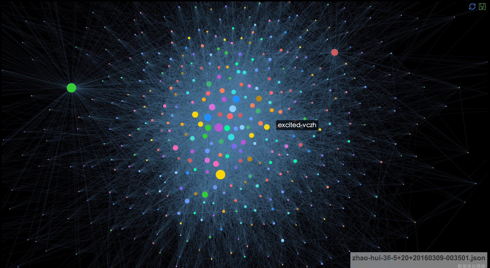

# python爬虫学习记录 #

个人兴趣，学习写爬虫，这里记录了一些学习过程中遇到的问题。

希望能把这个虫子写好。

第一个试手的目标是在知乎上做一个六度分割理论的验证。

## 其中用到的一些东西 ##

- pybloomfilter（哈希表工具）
- requests（Python高级http工具）
- eCharts（百度的一个数据可视化工具）

## 目前一些可视化的结果 ##

- 完整绘图结果

- 去除掉度为一的节点后的绘图结果
